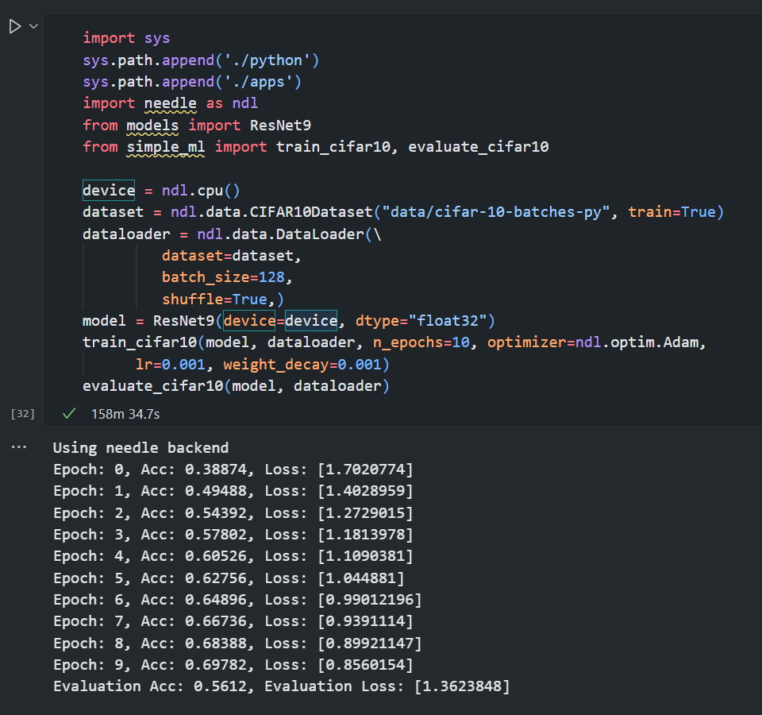
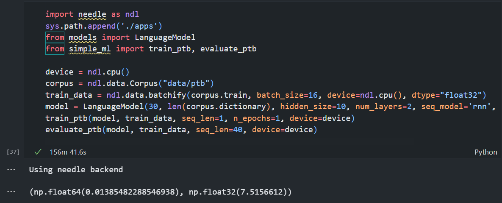

# CMU10-714

Implementations of Needle, a deep learning library from scratch.

- Course Website: <https://dlsyscourse.org/>

## Course Introduction

The goal of this course is to provide students an understanding and overview of the “full stack” of deep learning systems, ranging from the high-level modeling design of modern deep learning systems, to the basic implementation of automatic differentiation tools, to the underlying device-level implementation of efficient algorithms. Throughout the course, students will design and build from scratch a complete deep learning library, capable of efficient GPU-based operations, automatic differentiation of all implemented functions, and the necessary modules to support parameterized layers, loss functions, data loaders, and optimizers. Using these tools, students will then build several state-of-the-art modeling methods, including convolutional networks for image classification and segmentation, recurrent networks and self-attention models for sequential tasks such as language modeling, and generative models for image generation.

## Demo

Using Needle, a CNN model (ResNet9) can be trained and evaluated locally:

    
    

Also works for language model (RNN or LSTM), but w. way longer time to train:

    

## Final Project

*Plan: Add efficient transformer inference backend / multi-GPU training w. MPI. 

## Reference

I got to know this course thanks to [csdiy](https://csdiy.wiki/) and I referenced some implenmentations in hw4 from [this repo](https://github.com/PKUFlyingPig/CMU10-714).
