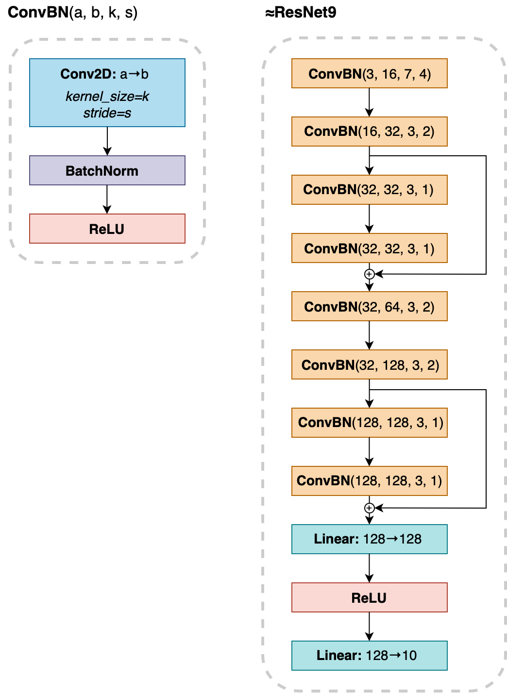
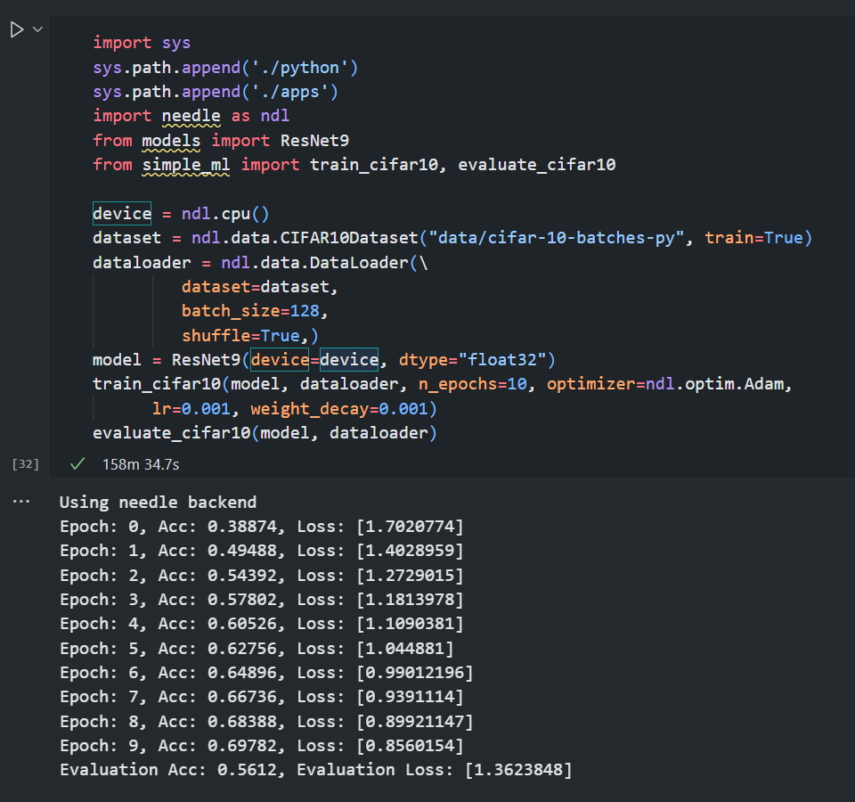

# CMU 10-714: Deep Learning Systems

Implementations of Needle, a deep learning library built from scratch.

- **Course Website**: [CMU 10-714](https://dlsyscourse.org/)

## Course Introduction

This course aims to provide students with a comprehensive understanding of the “full stack” of deep learning systems. It covers topics ranging from high-level model design to the implementation of automatic differentiation tools and device-level optimization of efficient algorithms.

Students will build a deep learning library from scratch, featuring efficient GPU-based operations, automatic differentiation, and modules for layers, loss functions, data loaders, and optimizers. Using these tools, students will develop state-of-the-art models such as convolutional networks for image classification and segmentation, recurrent networks and self-attention models for sequential tasks, and generative models for image generation.

## Demo

Needle enables local training and evaluation of deep learning models, such as a CNN (ResNet9):

    
    

Needle also supports language models such as RNNs, LSTMs, and Transformers, though training them requires significantly more time.

## Reference

I discovered this course through [CSDIY](https://csdiy.wiki/). Some implementations in hw4 and hw4_extra were inspired by [this repository](https://github.com/PKUFlyingPig/CMU10-714) and [this pull request](https://github.com/dlsyscourse/hw4_extra/pull/1).
